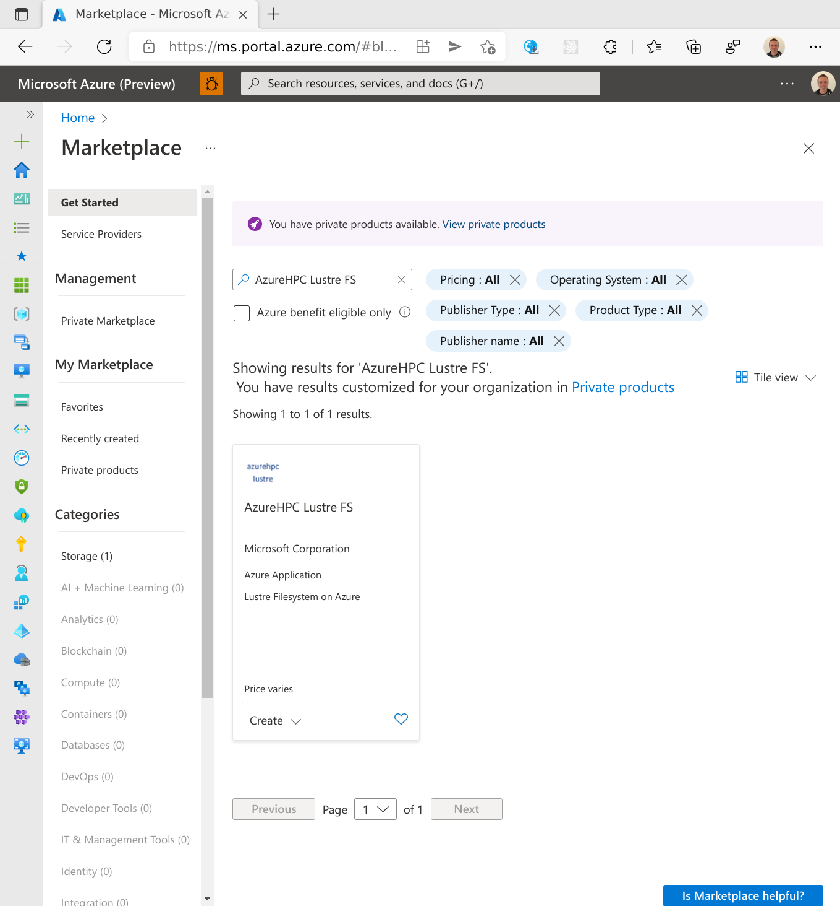
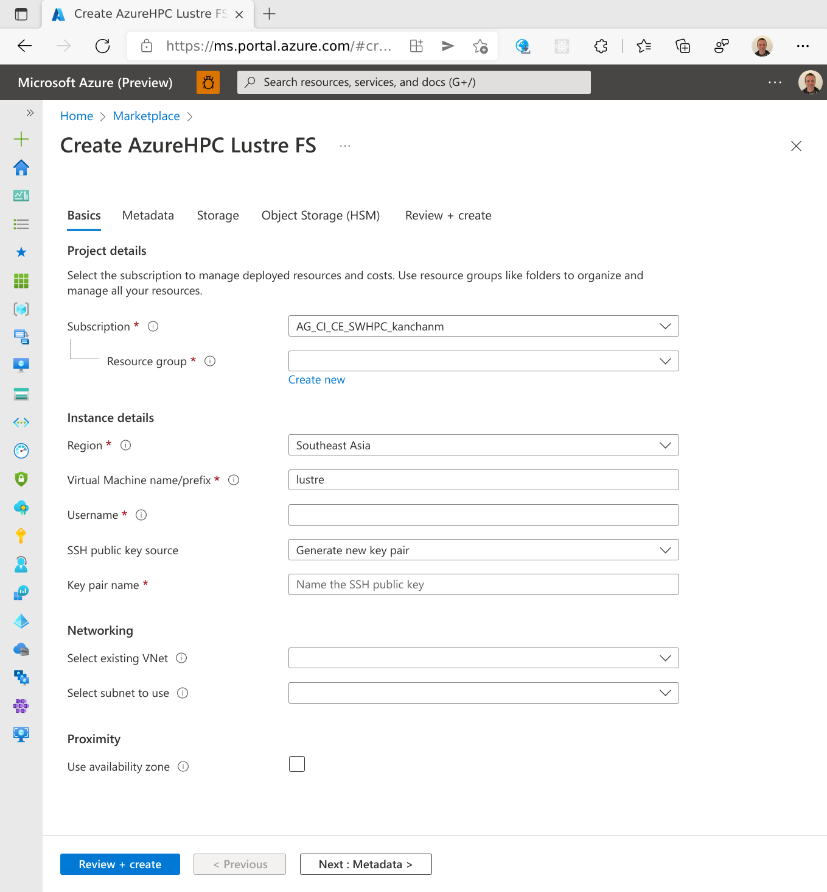
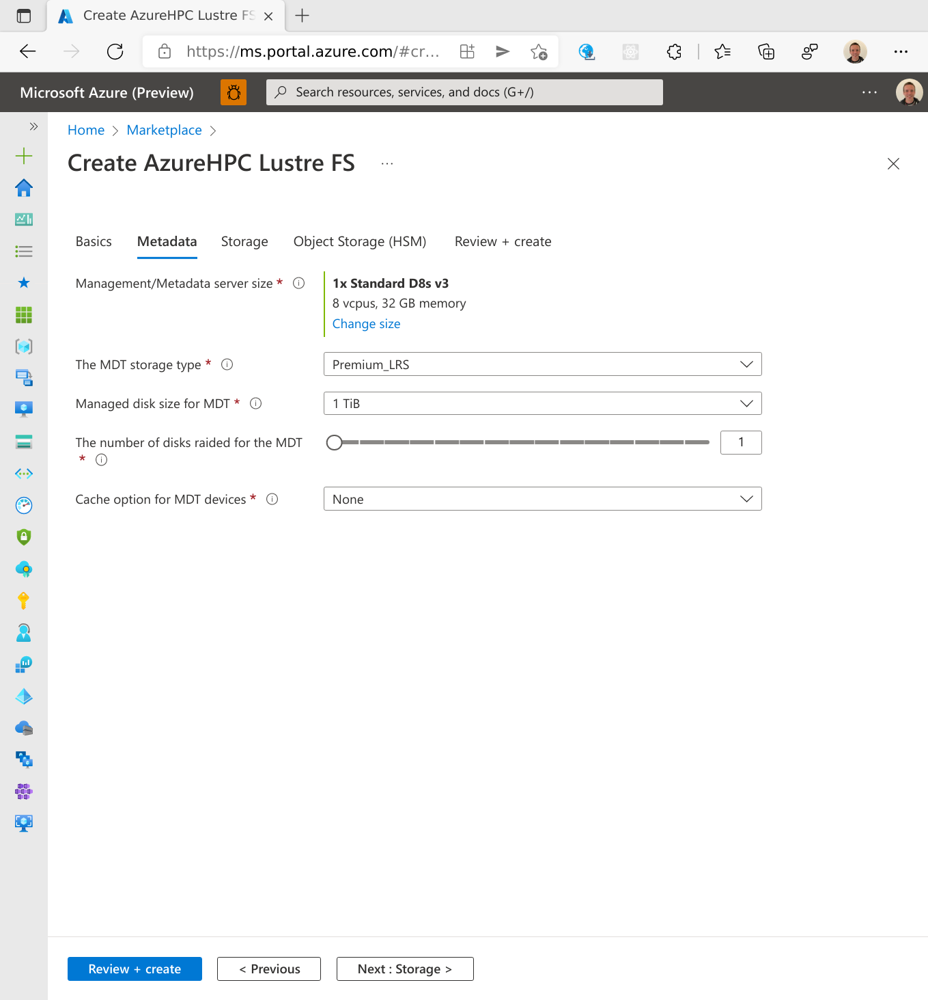
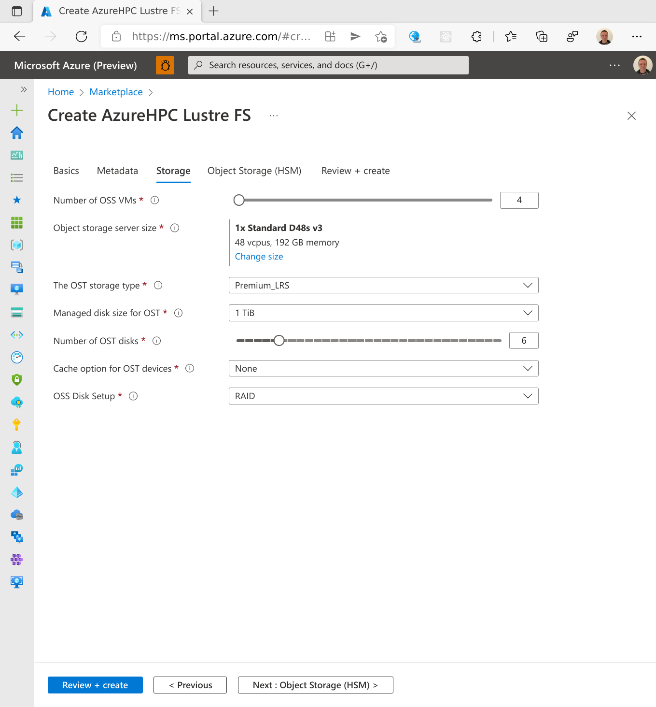
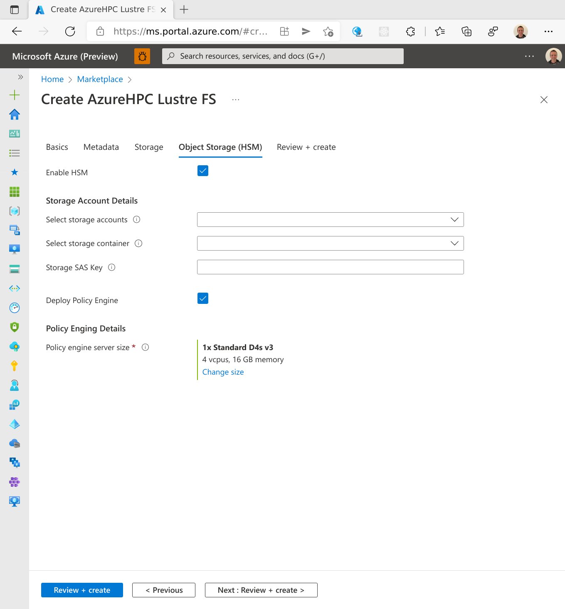
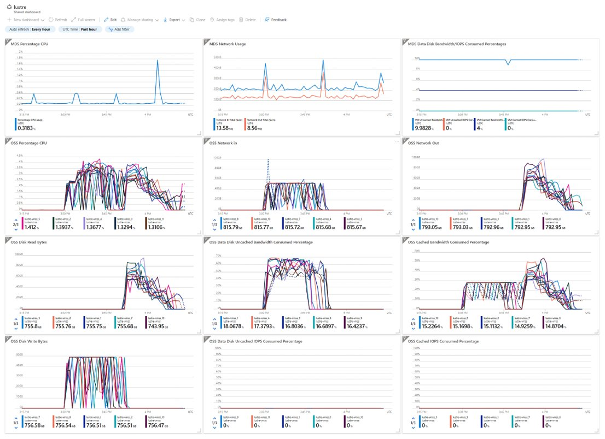
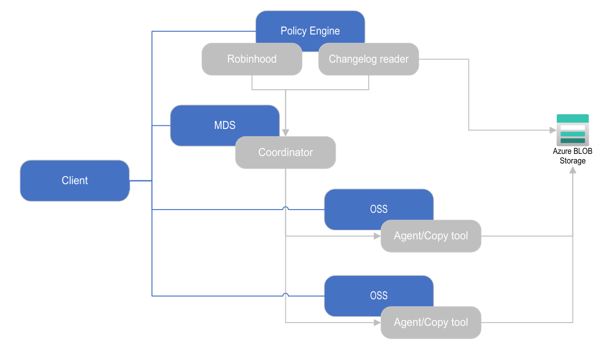

# AzureHPC Lustre Marketplace Offer 

The AzureHPC Lustre Marketplace offer provides a fast and easy way to deploy a Lustre Filesystem on Azure.  The features include:

* Deploy a Lustre Filesystem to an existing VNET in minutes​​
* Flexibility to select different VM SKUs and disk options to meet you IO requirements
* Import an Azure BLOB storage account using Lustre HSM​​
* Option to deploy a policy manager to keep the file system synchronised with Azure BLOB storage including automatic backup
* Dashboard to monitor Lustre performance​

> Disclaimer: The Marketplace offer will create the initial Filesystem that is up to the end user to manage. Support will only be provided on a best effort basis through "Issues" on the [azlustre](https://github.com/Azure/azlustre) github page.

## Example Sizes

When choosing VM and disk options you should pay attention to the different limits.  Here are the potential bottlenecks:

* VM expected network bandwidth
* VM maximum IOPs/bandwidth to managed storage ("Max uncached disk throughput" in the Azure documentation)
* VM maximum IOPs/bandwidth to temporary storage
* Managed storage IOPs/bandwidth per disk (ensure sufficient disks to fully utilize the VM uncached disk throughput))

The VM limits are set by the VM SKU and details are provided from [here](https://docs.microsoft.com/en-us/azure/virtual-machines/sizes).  The storage limits for managed disks are available [here](https://docs.microsoft.com/en-us/azure/virtual-machines/disks-scalability-targets#managed-virtual-machine-disks).

Below are some example configurations with expected performance:

| Parameter                  | Ephemeral 1                    | Ephemeral 2       | Persistent Premium     | Persistent Standard    |
|----------------------------|--------------------------------|-------------------|------------------------|------------------------|
| MDS SKU                    | Standard_D16d_v4               | Standard_L8s_v2   | Standard_D8_v3         | Standard_D8_v3         |
| MDT Storage Type           | Ephemeral                      | Ephemeral         | Premium_LRS            | Standard_LRS           |
| MDT Cache Option           | N/A                            | N/A               | ReadWrite              | ReadWrite              |
| MDT Disk Size              | N/A                            | N/A               | 1024                   | 1024                   |
| MDT Disks                  | N/A                            | N/A               | 2                      | 2                      |
| OSS SKU                    | Standard_D48d_v4               | Standard_L48s_v2  | Standard_D48_v3        | Standard_D48_v3        |
| OST Storage Type           | Ephemeral                      | Ephemeral         | Premium_LRS            | Standard_LRS           |
| OST Cache Option           | N/A                            | N/A               | None                   | None                   |
| OST Disk Size              | N/A                            | N/A               | 1024                   | 8192                   |
| OST Disks                  | N/A                            | N/A               | 6                      | 4                      |
| Size per OSS               | 1.8 TB                         | 7.6 TB            | 6 TB                   | 32 TB                  |
| Expected Bandwidth per OSS | 3000 MB/s                      | 1600 MB/s         | 1152 MB/s              | 1152 MB/s              |
| Limiting factor            | Network/temp storage bandwidth | Network bandwidth | Managed disk bandwidth | Managed disk bandwidth |

Improvements can be seen using SKUs with bursting capabilities in addition to enabling caching for

## Deployment Walkthrough

This section provides a walkthrough to create Lustre Filesystem from the Azure Marketplace Offer.  Ensure the following prerequisites have been completed before proceeding:

* The VNet/subnet must already be created in the subscription.
* A storage account and container should already exist if Hierarchical Storage Management/Policy Engine is used.

### Create the marketplace solution from the portal



Select `Marketplace` from the Azure Portal and search for `AzureHPC Lustre FS`.  Use the `Create` dropdown menu and select `AzureHPC Lustre 2.12`.

### AzureHPC Lustre FS Basic Options



The first options screen is split into four sections:

| Option                      | Description                                                                                |
|-----------------------------|--------------------------------------------------------------------------------------------|
| **Project details**         |                                                                                            |
| Subscription                | Select the subscription to use for provisioning.                                           |
| Resource group              | A new resource group is required to deploy the Lustre Filesystem.                          |
| **Instance details**        |                                                                                            |
| Region                      | The region where the Lustre Filesystem will be deployed.                                   |
| Virtual Machine name/prefix | This will be used as the MDS VM name and the prefix for the OSS VMSS and Policy Engine VM. |
| Username                    | The username for the compute resources.                                                    |
| SSH public key source       | Set up the SSH keys here for accessing the resources.                                      |
| **Networking**              |                                                                                            |
| Select existing VNet        | The name of the VNET where Lustre is to be deployed.                                       |
| Select subnet to use        | The subnet for the resources to use.                                                       |
| **Proximity**               |                                                                                            |
| Use availability zone       | Enable this to use a specific availability zone.                                           |

### AzureHPC Lustre FS Metadata Options



This screen is for options regarding the MDS.

| Option                                 | Description                                                                                                                                        |
|----------------------------------------|----------------------------------------------------------------------------------------------------------------------------------------------------|
| Management/Metadata service size       | The VM SKU for the MDS.                                                                                                                            |
| The MDF storage type                   | Choose between Premium, Standard or Ephemeral storage (the following options will not be available for ephemeral).                                 |
| Managed disk size for the MDT          | The disk size for each metadata target.                                                                                                            |
| The number of disks raided for the MDT | The number of disks to use.  It can be better to use multiple disks rather than a single larger disk in order to improve the total IOPs/bandwidth. |
| Cache option for the MDT devices       | This can be None, ReadOnly or ReadWrite.                                                                                                           |

### AzureHPC Lustre FS Storage Options



This screen is for options regarding the OSS.

| Option                           | Description                                                                                                        |
|----------------------------------|--------------------------------------------------------------------------------------------------------------------|
| Number of OSS VMs                | The number of OSS VMs to deploy.                                                                                   |
| Object storage server size       | The VM SKU for the OSS.                                                                                            |
| The OST storage type             | Choose between Premium, Standard or Ephemeral storage (the following options will not be available for ephemeral). |
| Managed disk size for the OST    | The disk size for each object storage target                                                                       |
| Number of OST disks              | The number of object storage targets per VM to use.                                                                |
| Cache option for the MDT devices | This can be None, ReadOnly or ReadWrite.                                                                           |
| OSS Disk Setup                   | The disks in the VM can either be separate OSTs or combined into a single RAIDed OST.                              |

### AzureHPC Lustre FS Object Storage (HSM) Options



This screen is for options regarding the HSM and whether to deploy a policy engine.

| Option                      | Description                                                           |
|-----------------------------|-----------------------------------------------------------------------|
| Enable HSM                  | Enable to setup HSM and link to a storage account.                    |
| **Storage Account Details** |                                                                       |
| Select storage accounts     | Choose the storage account to use.                                    |
| Select storage container    | Choose the container in the storage account.                          |
| Storage SAS Key             | Provide a SAS key for Lustre HSM to use - see below for instructions. |
| Deploy Policy Engine        | Enable to deploy the policy engine                                    |
| **Policy Engine Details**   |                                                                       |
| Policy engine server size   | The VM SKU for the policy engine                                      |

#### Storage SAS Key

The SAS key requires read, write, list and delete permissions.  Be aware when choosing an expiry time that it will be stored on the OSS/Policy Engine VMs and used for the HSM operations.  Here is an example of creating a SAS key with a 1 month expiry using the Azure CLI:

```
# TODO: set the account name and container name below
account_name=
container_name=

start_date=$(date +"%Y-%m-%dT%H:%M:%SZ")
expiry_date=$(date +"%Y-%m-%dT%H:%M:%SZ" --date "next month")

az storage container generate-sas \
   --account-name $account_name \
   --name $container_name \
   --permissions rwld \
   --start $start_date \
   --expiry $expiry_date \
   -o tsv
```

> Note: HSM will stop working if the SAS key expires.

### Deploy

After reviewing the options and selecting the `Create` button, the Lustre Filesystem will be deployed.  The deployment will take a few minutes to complete.

The new resource group will contain the following resources:

* MDS VM​
* OSS VMSS​
* Policy Engine VM \[_if policy engine is selected_\]
* Dashboard​

## Accessing the Lustre Filesystem

Once the deployment is complete the Lustre packages can be installed and the Filesystem can be mounted on client VMs.

### Installing the Lustre client packages

The version of Lustre is 2.12.5 although later versions of the client are usually backwards compatible.  The 2.12.5 packages can be downloaded from the [Whamcloud download site](https://downloads.whamcloud.com/public/lustre/lustre-2.12.5/).

Below is a script that will install the Lustre client packages on a CentOS 7.8.

```
lustre_dir=lustre-2.12.5

# set up the Lustre repository
cat << EOF >/etc/yum.repos.d/LustrePack.repo
[lustreserver]
name=lustreserver
baseurl=https://downloads.whamcloud.com/public/lustre/${lustre_dir}/el7/patchless-ldiskfs-server/
enabled=1
gpgcheck=0
[e2fs]
name=e2fs
baseurl=https://downloads.whamcloud.com/public/e2fsprogs/latest/el7/
enabled=1
gpgcheck=0
[lustreclient]
name=lustreclient
baseurl=https://downloads.whamcloud.com/public/lustre/${lustre_dir}/el7/client/
enabled=1
gpgcheck=0
EOF

# install the client RPMs if not already installed
if ! rpm -q lustre-client kmod-lustre-client; then
    yum -y install lustre-client kmod-lustre-client
fi
weak-modules --add-kernel $(uname -r)
```

### Mounting the Lustre Filesystem

The script below will mount the filesystem.  Make sure that `lustre_name` is the `Virtual Machine name/prefix` chosen at deployment time and the `lustre_mount` is the mount point to be created and used.

```
lustre_name=lustre
lustre_mount=/lustre

mkdir -p $lustre_mount
echo "${lustre_name}@tcp0:/LustreFS $lustre_mount lustre flock,defaults,_netdev 0 0" >> /etc/fstab
mount -a
```

## Monitoring the Filesystem with the Dashboard

The dashboard can be accessed through the portal and provides the following information:

* Metrics for MDS and OSS VMs​
* CPU Usage​
* Network​
* Disk metrics​
* Disk writes​
* Consumed Uncached IOPs/Bandwidth​
* Consumed Cached IOPs/Bandwidth​

This can be used to easily identify performance bottlenecks or badly performing VMs.



## Policy Engine

The policy engine VM runs [RobinHood](https://github.com/cea-hpc/robinhood) is used in addition to a lustre changelog reader from the [lemur](https://github.com/edwardsp/lemur) repository.  These are both run as systemd services on the policy engine VM.  The services are called `robinhood` and `lustremetasync`.

HSM was designed for just archive data and assumes the metadata target will persist.  The lustre setup on Azure will maintain metadata in Azure BLOB storage so the filesystem can be removed and easily recreated.  The reason for the changelog reader is to handle cases not covered by RobinHood and HSM:

* Creating/deleting directories in the archive
* Creating/deleting symlinks in the archive
* Updating owner/attribute changes to files and directories
* Handle moving files/directories

This is diagram shows show the Lustre is set up with HSM and the policy engine:



The RobinHood setup has the following options:

* Files are archived after 30 minutes of in-activity
* Files are released once the filesystem reaches 85% capacity

The Robinhood config files are in `/etc/robinhood.d/lustre.conf` on the policy engine VM.


## Software Versions

The AzureHPC Lustre image uses OpenLogic CentOS 7.8 as the base image.  The Lustre version is 2.12.5 and packages are from the [Whamcloud download site](https://downloads.whamcloud.com/public/lustre/lustre-2.12.5/).  The HSM version packages are compiled from [lemur v2.1.2](https://github.com/edwardsp/lemur/releases/tag/2.0.2).  All the installation scripts are available on GitHub in the [azlustre](https://github.com/Azure/azlustre) project.
